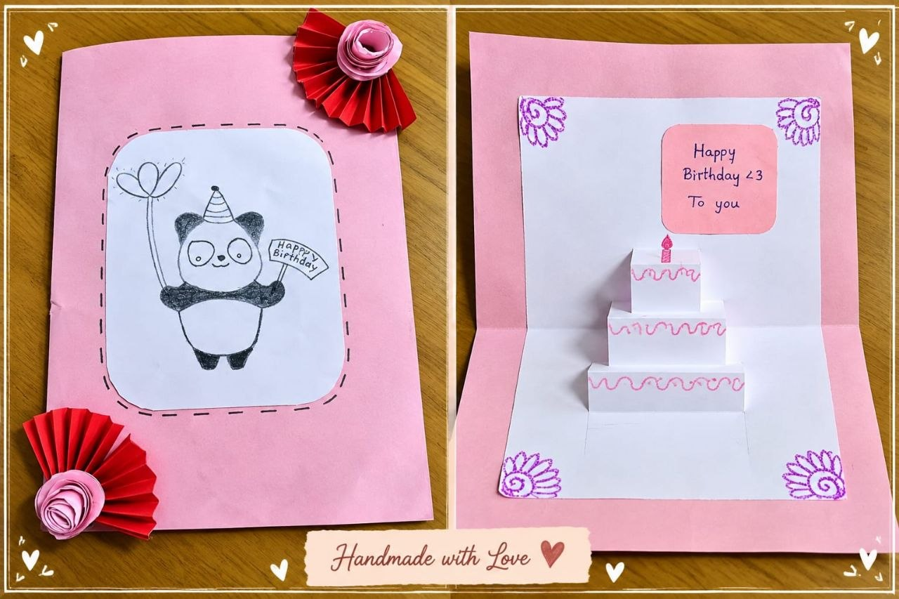

PULSE TEAM  

**DISCRIPTOIN**  
        A Pulse greeting card is an electronic greeting card that uses LEDs to produce a      glowing effect when the card is opened. A simple electrical circuit containing a battery, LEDs, and a switch is placed inside the card. The switch turns the LEDs ON when the card is opened and OFF when it is closed.  
   
**MATERIALS USED**

 ➤ LED(s)  
 ➤ 3V coin-cell battery  
 ➤ Aluminium foil  
 ➤ Glue / double-sided tape  
 ➤ Scissors and cutter  
 ➤ Decorative materials

**PROCEDURE**

    1\. Card Preparation

             ➤ Take a thick sheet of cardboard and fold it into a greeting-card shape. Mark the   
                  positions where the LEDs and other components will be placed.  
                                  
     2\. LED Placement

             ➤  Make small holes at the marked positions and insert the LEDs through them. Fix  
                   the LEDs properly so they do not move.

     3\. Circuit Connection

             ➤  Connect the LEDs to a battery through wires and a small switch. Arrange the   
                   circuit neatly inside the card and secure the components.

    4\. Testing & Decoration

             ➤ Open and close the card to check whether the LEDs turn ON and OFF properly.   
                  Finally, decorate the card with paper, drawings, or other decorative materials.

**CIRCUIT**  

**RESULT**  

CONCLUSION

     The Pulse light-up greeting card was successfully designed and tested. The circuit  
    makes the card attractive by producing a glowing effect when opened. This project       
    demonstrates the basic principles of electronic circuits and creative design.  

cGhKWiLDvxPBrm3TGNf188AAAAASUVORK5CYII=
